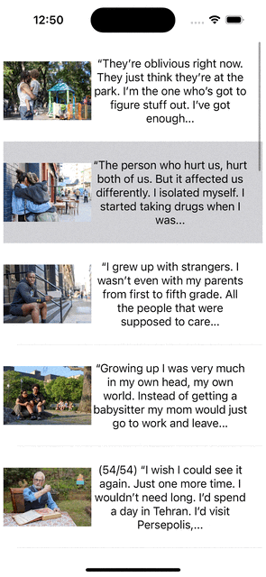

# Project 5 - Tumbler App

Submitted by: Jason Morales

Tumbler App is an app that presents Tumbler Posts in a table view

Time spent: 2 hours spent in total

## Required Features

The following **required** functionality is completed:

- [X] App has a configured table view and table view call
- [X] App populates the table view with data fetched from an API

## Video Walkthrough

## Notes

Describe any challenges encountered while building the app.

## License

    Copyright 2023 Jason Morales

    Licensed under the Apache License, Version 2.0 (the "License");
    you may not use this file except in compliance with the License.
    You may obtain a copy of the License at

        http://www.apache.org/licenses/LICENSE-2.0

    Unless required by applicable law or agreed to in writing, software
    distributed under the License is distributed on an "AS IS" BASIS,
    WITHOUT WARRANTIES OR CONDITIONS OF ANY KIND, either express or implied.
    See the License for the specific language governing permissions and
    limitations under the License.
